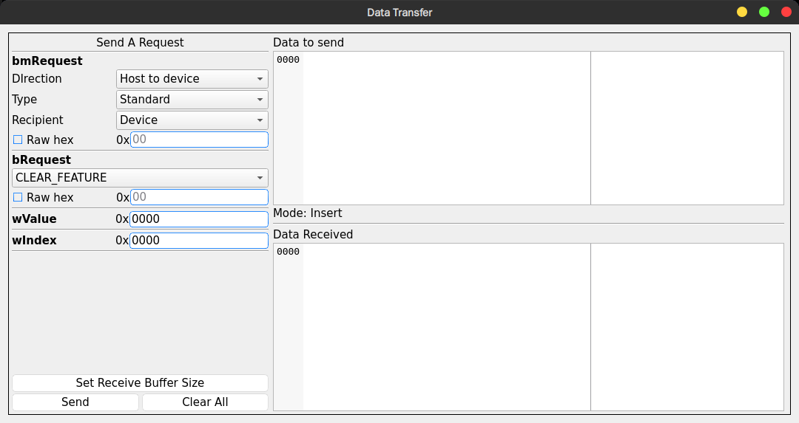

# usb-regulus


[](https://github.com/NichtsHsu/usb-regulus/blob/master/LICENSE)
[](https://996.icu)

A GUI tool for USB viewing, reading and writing.

## Note

You are suggested to install an udev rule file for unprivileged users to be able to access USB device.

See: [libusb calls without sudo using udev-rules](https://stackoverflow.com/questions/40597515/libusb-calls-without-sudo-using-udev-rules).

Alternatively, simply run this application with root privileges.

## Features

* [x] Support detect and list USB devices
* [x] Support hotplug
* [x] Support parse and show following descriptors:
  * [x] Configuration Descriptor
  * [x] Device Descriptor
  * [x] Interface Descriptor
  * [x] Endpoint Descriptor
  * [x] Hub Descriptor
  * [x] BOS Descriptor
  * [x] All Device Capability Descriptors specified at USB Spec 3.2
  * [x] Following extra descriptors of Interface Descriptors
    * [x] HID Descriptor and its Report Descriptor
    * [x] DFU Descriptor
    * [x] All Descriptors specified at Audio Spec v1.0
    * [x] All Descriptors specified at Audio Spec v2.0
    * [ ] All Descriptors specified at Audio Spec v3.0
    * [x] All Descriptors specified at Video Spec v1.5
  * [x] Following extra descriptors of Configuration Descriptors
    * [x] Interface Association Descriptor
    * [x] OTG Descriptor
    * [x] Security Descriptor
    * [x] Encryption Type Descriptor
* [x] Support Endpoint data transfers
* [x] Display or edit data in hex and ASCII, supported by [QHexEdit](https://github.com/Simsys/qhexedit2)
* [x] Support set altnative settings of interfaces
* [x] Multiple themes supported by [GTRONICK/QSS](https://github.com/GTRONICK/QSS)

## Screenshots





## Download

The [release page](https://github.com/NichtsHsu/usb-regulus/releases) provides the lastest AppImage files.

## Build

## Clone with submodules

```bash
git clone --recurse-submodules https://github.com/NichtsHsu/usb-regulus.git
```

### Linux

1. Install [Qt6](https://www.qt.io/download) and select GCC x64 toolkit.
2. Install necessary C++ compiling enviroment, such as `build-essential`, `g++`, `make`, `cmake` and so on.
3. Install `libusb-1.0` and `libudev`. For an example, on Ubuntu:

    ```bash
    sudo apt install libusb-1.0-0-dev libudev-dev
    ```

4. Open Qt Creator, and select this project, then build. Or, if you would like to build with terminal:

    ```bash
    cd usb-regulus
    mkdir build
    cd build
    {Your Qt Install Path}/gcc_64/bin/qmake ..
    make
    ```

5. Run with `./usb-regulus` command.
5. Copy the `assets` folder under build directory together if you want to copy the `usb-regulus` binary file.

### MacOS

I have never used MacOS, but it should not be much different from Linux.

### Windows

**Not Support Yet**

Because `libusb` doesn't seem to work well on Windows, especially it does not support hotplug. I'm looking for the possibility to use WinUsb instead of libusb, but the work will not be started until the basic functions on Linux are done.

## Reference

1. [Qt](https://www.qt.io/).
2. [QtUsb](https://github.com/fpoussin/QtUsb).
3. [usbutils](https://github.com/gregkh/usbutils), especially lsusb.
4. [usbhid-dump](https://github.com/DIGImend/usbhid-dump).
5. [hidrd](https://github.com/DIGImend/hidrd).
6. [QHexEdit](https://github.com/Simsys/qhexedit2).
7. [Qt Themes](https://github.com/GTRONICK/QSS).
